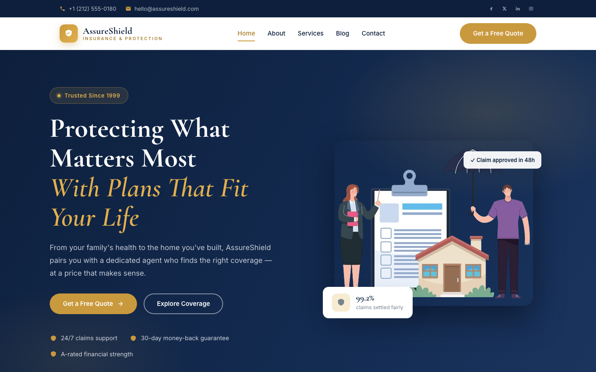

# AssureShield — Premium Insurance Company Template

A premium, framework-free HTML template for an insurance company. Deep navy and warm gold on clean white, driven by Cormorant Garamond display type and Inter body text — a confident, trustworthy presence for life, health, car and home coverage.

## 📸 Screenshot

## Design System

| Token | Value |
|-------|-------|
| **Ground** | `--clr-ink` `#0d1f3c` (deep navy), `--clr-paper` `#ffffff` |
| **Primary** | `--clr-gold` `#c9993d`, `--clr-gold-bright` `#e2b04e` |
| **Accent** | `--clr-navy` `#132a4f`, `--clr-navy-soft` `#1b355f` |
| **Surface** | `--clr-card` `#ffffff`, `--clr-mist` `#f6f4ef`, `--clr-line` `#e4e2dc` |
| **Text** | `--clr-heading` `#0d1f3c`, `--clr-text` `#46535f`, `--clr-muted` `#77848f` |
| **Display type** | `Cormorant Garamond` (400–700, incl. italics) |
| **Body type** | `Inter` (400–700) |
| **Container** | 1200px max-width, centered |
| **Radius** | 14px |
| **Breakpoints** | ~992px, ~768px, ~576px |

## Pages

| Page | File | Description |
|------|------|-------------|
| Home | [index.html](index.html) | Topbar, navy hero with illustration, stats band, four service cards, about split with check-list, testimonial, CTA |
| About | [about.html](about.html) | Story since 1999, stats band, three value cards, four agent cards |
| Services | [services.html](services.html) | Four detailed coverage panels, three-step process |
| Blog | [blog.html](blog.html) | Three article cards with tags, meta and read links |
| Contact | [contact.html](contact.html) | Info list, topic-select quote form, embedded map |
| 404 | [404.html](404.html) | On-brand error page with recovery links |

## Features

- **Framework-free** — pure HTML5, CSS3 (custom properties, Grid, Flexbox, `clamp()`), vanilla JavaScript
- **Trustworthy insurance aesthetic** — deep navy + warm gold, Cormorant Garamond headlines
- **Fluid responsive** — three breakpoints, no horizontal scroll on any viewport
- **Scroll reveal** — IntersectionObserver-powered `.reveal` animations (respects `prefers-reduced-motion`)
- **Mobile nav** — burger toggle with `aria-expanded` accessible pattern
- **Topbar** — contact strip with phone, email and social icons
- **Hero** — navy gradient with floating stat card and approval chip
- **Stats band** — four data points on dark background with gold divider
- **Service cards** — icon, name, description, call-to-action link
- **About split** — photo with floating badge, check-list and CTA
- **Team cards** — photography, name, role, social links
- **Testimonial** — full-width navy panel with quote and avatar
- **Value cards** — icon, heading, paragraph
- **Coverage panels** — alternating image/text blocks with feature lists
- **Contact form** — topic select, validation feedback, `[data-form]` hook
- **Original imagery** — insurance and family photography, no placeholders

## Tech Stack

- HTML5 + CSS3 (W3C-valid, semantic landmarks)
- Vanilla JavaScript (canonical IIFE build)
- Google Fonts (Cormorant Garamond + Inter)
- SVG favicon (inline data: URI)
- OpenStreetMap embed (contact page)

## SEO

- Semantic HTML5 structure (`<header>`, `<nav>`, `<main>`, `<section>`, `<footer>`)
- Unique `<title>` and `<meta description>` per page
- `lang="en"` attribute, `charset="utf-8"`, viewport meta
- Alt text on all images

## License

Free for personal and commercial use. Attribution appreciated but not required.

---

## Let's Build Something Together 🚀

[Book a free consultation](https://tally.so/r/q4q1L9)
